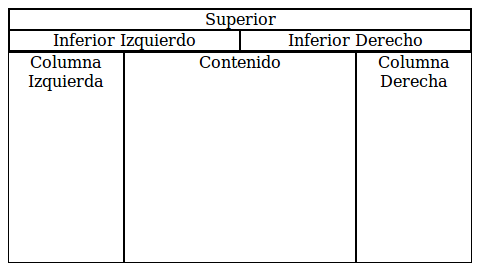

# Layout para OSscar Jdp

Esta es la respuesta para una pregunta de OSscar Jdp en [Programadores Chile](https://www.facebook.com/groups/Programadores.Chile) sobre cómo hacer un layout en HTML.

En su pregunta, OSscar especifica que el layout debe verse de la siguiente manera:

Se propone la siguiente solución: <layout_osscar_jdp.html>

La siguiente es una captura de pantalla de cómo se ve la solución:

Debe notarse que la solución propuesta no usa "flexbox" debido a la complejidad de esta tecnología para un principiante. Además se ha validado la solución utilizando <https://validator.w3.org/>.
