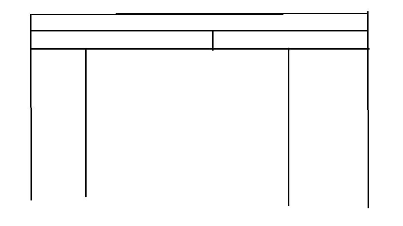

# Layout para OSscar Jdp

Esta es la respuesta para una pregunta de OSscar Jdp en [Programadores Chile](https://www.facebook.com/groups/Programadores.Chile) sobre cómo hacer un layout en HTML.

En su pregunta, OSscar especifica que el layout debe verse de la siguiente manera:

Se propone la siguiente solución:

<!DOCTYPE html>

<meta charset="utf-8">
<meta name="author" content="Cristóbal Ganter">

<title>Layout para OSscar Jdp</title>

<header>
    

        Superior
    

        Inferior Izquierdo
    

        Inferior Derecho
    

</header>

    Columna Izquierda

    Contenido

    Columna Derecha

Debe notarse que la solución propuesta no usa "flexbox" debido a la complejidad de esta tecnología para un principiante.
